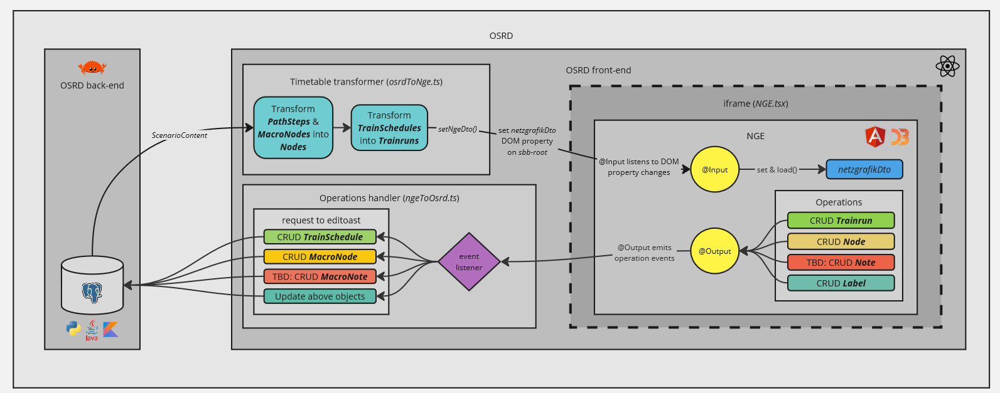

Netzgrafik-Editor (NGE) is an open-source software that enables the creation, modification, and analysis of regular-interval timetable, at a macroscopic level of detail, developed by [Swiss Federal Railways (SBB CFF FFS)](https://www.sbb.ch/). See [front-end](https://github.com/SchweizerischeBundesbahnen/netzgrafik-editor-frontend) and [back-end](https://github.com/SchweizerischeBundesbahnen/netzgrafik-editor-backend) repositories.

OSRD and NGE are are semantically different: the former uses a microscopic level of detail, based on a well-defined infrastructure, depicting a timetable composed of unique train schedules, while the latter uses a macroscopic level of detail, not based on any explicit infrastructure, depicting a transportation plan made up of regular-interval based train runs. However, these differences, close enough, may be arranged to make it work together.

The compatibility between NGE and OSRD has been tested through a proof of concept, by running both pieces of software as separate services and without automated synchronization.

The idea is to give to OSRD a graphical tool to edit (create, update and delete train schedules from) a timetable from an operational study scenario, and get some insights on analytics at the same time. Using both microscopic and macroscopic levels of detail brings a second benefit: OSRD's microscopic calculations extend the actual scope of NGE, its functionalities and information provided, such as the microscopic simulations or the conflicts detection tool.

The transversal objective of this feature is to make two open-source projects from two big railway infrastructure managers work along and cooperate with one another with the same goal: ensure a digital continuity on different time scales for railway operational studies.

#### 1 - Integration in OSRD

OSRD has developed a `standalone` version of NGE, integrated into the source code, which allows NGE to work without a back-end. Thus, for external use, a [build of NGE `standalone` is available on NPM](https://www.npmjs.com/package/netzgrafik-frontend) and is published at each release. Finally, to meet OSRD-specific needs, OSRD uses a [fork](https://github.com/osrd-project/netzgrafik-editor-frontend) of NGE (whose [build, NGE `standalone`, is also available on NPM](https://www.npmjs.com/package/@osrd-project/netzgrafik-frontend)), remaining as close as possible to the official directory.

Despite using different JavaScript frameworks (ReactJS for OSRD and Angular for NGE), this build allows OSRD to integrate NGE within an [`iframe`](https://developer.mozilla.org/fr/docs/Web/HTML/Element/iframe). This `iframe` instantiates a [`Custom Element`](https://developer.mozilla.org/en-US/docs/Web/API/Web_components/Using_custom_elements), which is be the communication interface between both applications and launch NGE's build.

An alternative solution to the integration problem would have been to rewrite NGE as [`web-components`](https://developer.mozilla.org/fr/docs/Web/API/Web_components), in order to import them into OSRD, but this solution was abandoned because of the amount of work it would represent.

NGE, in its `standalone` version, communicates with OSRD through the `iframe` using DOM element properties:
- [`@Input`](https://github.com/SchweizerischeBundesbahnen/netzgrafik-editor-frontend/blob/fe3e788499e18054e260c05e714419aeeafc44e1/src/app/app.component.ts#L75): with the `netzgrafikDto` property, triggered when the content of the scenario is updated from OSRD.
- [`@Output`](https://github.com/SchweizerischeBundesbahnen/netzgrafik-editor-frontend/blob/fe3e788499e18054e260c05e714419aeeafc44e1/src/app/app.component.ts#L84): with the [`operations`](https://github.com/SchweizerischeBundesbahnen/netzgrafik-editor-frontend/blob/main/documentation/STANDALONE.md) property, triggered when NGE is used.

NGE is then able to obtain the OSRD timetable as soon as a change is made on the OSRD side, and OSRD is able to obtain the changes made on the NGE side.

#### 2 - Converters

To overcome semantic differences and adapt data models, two converters are implemented:
- **[OSRD -> NGE]** a converter which transforms an OSRD timetable into an NGE model. The nodes are the waypoints described by the train schedules, and whose macroscopic information (position on the reticular) is stored in the database. OSRD train schedules, `TrainSchedule`, then represent cadenced train lines in NGE, `Trainrun`. A concept of cadenced train lines, will soon be implemented to allow conceptual convergence between OSRD and NGE.
- **[OSRD <- NGE]** an event manager, which transforms an NGE action into an update of the OSRD database.

#### 3 - Open-source (cooperation / contribution)

To make NGE compatible with OSRD, some changes have been requested (disable back-end, create hooks on events) and directly implemented in the [official repository of NGE](https://github.com/SchweizerischeBundesbahnen/netzgrafik-editor-frontend), with the agreement and help of NGE team.

Contributions for one project to another, from both sides, are valuable and will be entertained in the future.

This feature also shows that open-source cooperation is powerful and a huge gain of time in software development.
