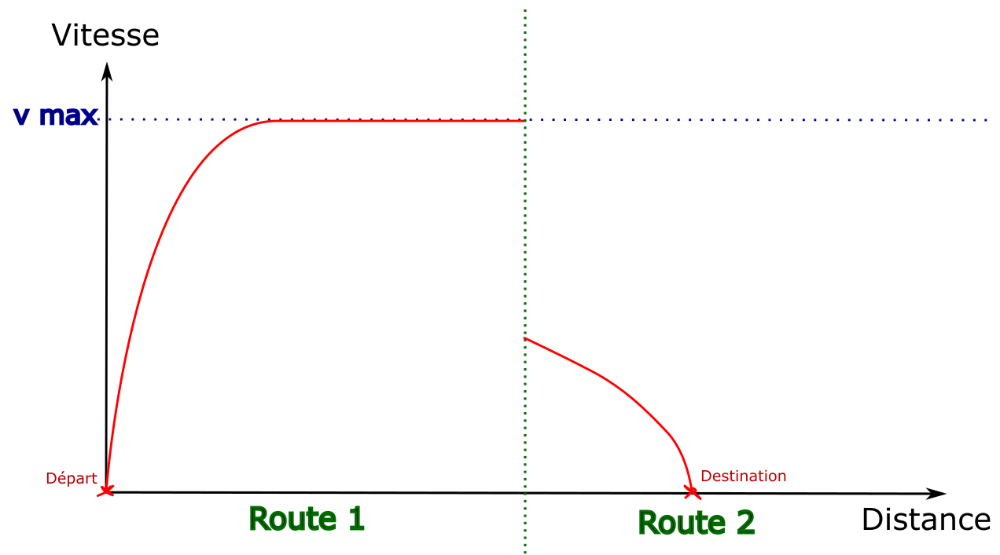
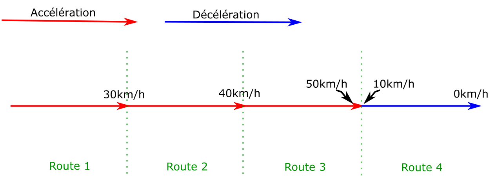

#### The discontinuity problem

When a new graph edge is visited, a simulation is run to evaluate
its speed. But it is not possible to see beyond the current edge.
This makes it difficult to compute braking curves, because
they can span over several edges.

> This example illustrates the problem: by default
> the first edge is explored by going at maximum speed.
> The destination is only visible once the second edge is visited,
> which doesn't leave enough distance to stop.

#### Solution : backtracking

To solve this problem, when an edge is generated with a
discontinuity in the speed envelopes, the algorithm goes back
over the previous edges to create new ones that include the
decelerations.

To give a simplified example, on a path of 4 edges
where the train can accelerate or decelerate by 10km/h per edge:

For the train to stop at the end of route 4, it must be at most
at 10km/h at the end of edge 3. A new edge is then created on
edge 3, which ends at 10km/h. A deceleration is computed
backwards from the end of the edge back to the start,
until the original curve is met (or the start of the edge).

In this example, the discontinuity has only been moved to the
transition between edges 2 and 3. The process is then repeated
on edge 2, which gives the following result:

Old edges are still present in the graph as they can lead to other solutions.