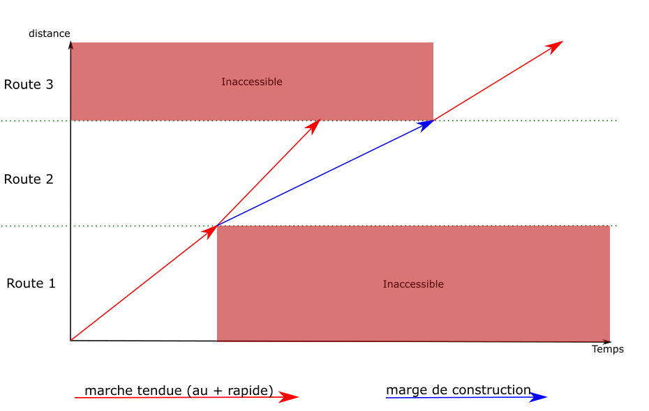

While exploring the graph, it is possible to end up in locations that would
generate conflicts. They can be avoided by adding delay.

#### Shifting the departure time

The departure time is defined as an interval in the module parameters:
the train can leave at a given time, or up to `x` seconds later.
Whenever possible, delay should be added by shifting the departure time.

> for example : a train can leave between 10:00 et 11:00. Leaving
> at 10:00 would cause a conflict, the train actually needs to enter the
> destination station 15 minutes later. Making the train leave at
> 10:15 solves the problem.

In OSRD, this feature is handled by keeping track, for every edge,
of the maximum duration by which we can delay the departure time.
As long as this value is enough, conflicts are avoided this way.

This time shift is a value stored in every edge of the path.
Once a path is found, the value is summed over the whole path.
This is added to the departure time.

> For example :
> - a train leaves between 10:00 and 11:00. The initial maximum
> time shift is 1:00.
> - At some point, an edge becomes unavailable 20 minutes after the
> train passage. The value is now at 20 for any edge accessed from here.
> - The departure time is then delayed by 5 minutes to avoid a conflict.
> The maximum time shift value is now at 15 minutes.
> - This process is applied until the destination is found,
> or until no more delay can be added this way.

#### Engineering allowances

Once the maximum delay is at 0, the delay needs to be added
between two points of the path.

The idea is the same as the one used to fix speed discontinuities:
new edges are created, replacing the previous ones.
The new edges have an engineering allowance, to add the delay where
it is possible.

computing an
[engineering allowance]( "allowances")
is a feature of the running-time
calculation module. It adds a given delay between two points of
a path, without affecting the speeds on the rest of the path.